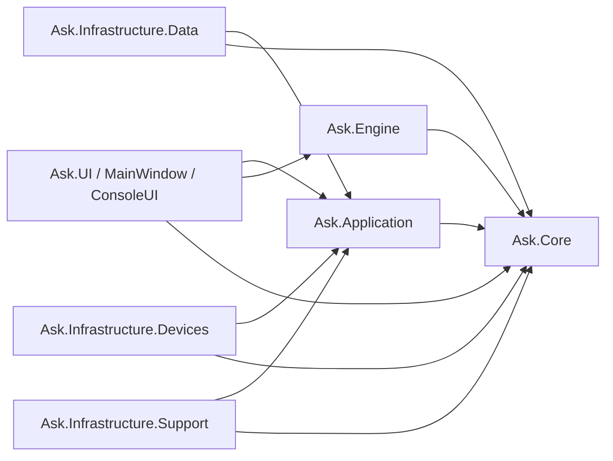

# Чистая архитектура и карта миграции

## Назначение
Этот документ фиксирует целевую архитектуру решения `AskMkiM` и определяет путь миграции от текущей структуры к варианту, согласованному с принципом зависимостей из книги Роберта Мартина «Чистая архитектура».

Главная цель: сделать бизнес-логику независимой от:
- WPF и деталей desktop UI
- EF Core и SQLite
- `NewCore`, WMI, COM/USB, `Process.Start`, файловой системы
- `ServiceLocator`, статического состояния и скрытой композиции зависимостей

Этот документ является базовой точкой для задачи `#363` и всех последующих задач по рефакторингу.

## Архитектурные принципы

### Правило зависимостей
Зависимости в исходном коде должны быть направлены только внутрь:
- внешние слои могут зависеть от внутренних
- внутренние слои не должны зависеть от внешних
- бизнес-правила не должны знать о UI, базе данных, фреймворках и API операционной системы

### Ответственность слоёв
- `Ask.Core`: сущности, value objects, доменные интерфейсы, доменные правила, инварианты
- `Ask.Application`: use cases, orchestration, порты, input/output модели
- `Ask.Engine`: алгоритмы анализа и исполнения команд, выраженные через порты и доменные абстракции
- `Ask.Infrastructure.*`: детали реализации хранения данных, работы с устройствами, системного доступа, help-server, логирования
- `Ask.UI` и `MainWindow`: interface adapters, presentation layer, composition root

### Стратегия миграции
- без Big Bang переписывания
- с сохранением текущего пользовательского поведения
- через швы: сначала вводим интерфейсы и границы, потом переносим реализации
- с фиксацией границ на уровне project references и архитектурных тестов

## Текущее состояние архитектуры

Решение уже разделено на несколько проектов, но в текущем виде не соблюдает правило зависимостей последовательно.

### Текущие роли проектов

| Проект | Текущая роль | Прямые зависимости | Основная проблема |
| --- | --- | --- | --- |
| `Ask.Core` | Общие контракты, модели, сервисы | `Ask.LogLib`, `Microsoft.Extensions.Hosting`, `System.Management` | Ядро не является независимым от фреймворков и ОС |
| `Ask.Engine` | Анализ и исполнение команд | `Ask.Core`, `Ask.LogLib`, `DataBaseConfigruration`, `Message` | Движок зависит от data-layer и presentation concern |
| `DataBaseConfigruration` | EF Core, SQLite, конфигурация | `Ask.Core`, `NewCore` | Слой данных знает про runtime-устройства и участвует в их создании |
| `NewCore` | Runtime-логика устройств и связь с оборудованием | `Ask.Core` | Допустим как инфраструктура, но сейчас используется напрямую верхними слоями |
| `UI` | Legacy WPF UI | `Ask.Core`, `Ask.Engine`, `Ask.Support`, `Ask.UI`, `DataBaseConfigruration`, `Message`, `NewCore` | God-project: смешаны presentation, use cases, EF, WMI, файлы, процессы, интеграции |
| `Ask.UI` | Более новый UI-слой и переиспользуемые компоненты | `Ask.Core`, `Ask.Support`, `Message`, `NewCore` | Структура лучше, но слой всё ещё связан с runtime/support деталями |
| `MainWindow` | Точка входа и shell приложения | `Ask.Support`, `Ask.UI`, `ConsoleUI`, `DataBaseConfigruration`, `Message`, `UI` | Composition root смешан с legacy UI и инфраструктурой |
| `Ask.Support` | Вспомогательные сервисы, help-server | `Ask.LogLib`, ASP.NET/Photino пакеты | Инфраструктурные детали смешаны с app graph |
| `Message` | Уведомления и сообщения пользователю | нет | Presentation concern, должен оставаться ближе к UI |
| `Ask.LogLib` | Логирование | NLog | Инфраструктурный cross-cutting слой |

### Ключевые нарушения правила зависимостей

1. `Ask.Engine` зависит от `DataBaseConfigruration`
   - бизнес-логика читает конфигурацию через EF/data services напрямую
   - движок нельзя нормально тестировать и переиспользовать без текущего слоя БД

2. `DataBaseConfigruration` зависит от `NewCore`
   - слой хранения данных знает о runtime-типах устройств
   - данные БД и JSON участвуют в создании живых объектов

3. `UI` смешивает все слои сразу
   - code-behind содержит use case-логику
   - UI сам открывает файлы, запускает процессы, ходит в WMI и пишет в БД
   - presentation layer фактически выполняет роль application service, repository client и system adapter одновременно

4. `Ask.Core` пока не является чистым доменным слоем
   - содержит зависимости на `Microsoft.Extensions.Hosting`
   - содержит зависимость на `System.Management`
   - хранит не только доменные, но и framework/application concerns

5. Глобальное состояние и скрытая композиция зависимостей
   - `DataBaseConfig.Context`
   - `ServiceLocator`
   - ручные `new SomeServices()` внутри внутренних слоёв

## Целевая архитектура

### Целевые логические слои

Важно:
- Стрелки показывают compile-time зависимости.
- `Ask.Engine` остаётся отдельным модулем, потому что в текущем решении он уже выделен как самостоятельная подсистема исполнения.
- `Ask.Engine` должен зависеть только от `Ask.Core` и, при необходимости, от стабильных абстракций/портов. Он не должен зависеть от EF, WPF, `Message`, `NewCore` или legacy data-layer.

### Целевая карта проектов

| Целевой проект | Ответственность | Может зависеть от |
| --- | --- | --- |
| `Ask.Core` | Сущности, value objects, доменные enum, доменные интерфейсы, инварианты | только BCL; временные исключения должны быть отдельно зафиксированы |
| `Ask.Application` | Use cases, orchestration, порты, request/response модели, транзакционные границы через абстракции | `Ask.Core` |
| `Ask.Engine` | Алгоритмы разбора и исполнения команд через доменные порты | `Ask.Core`, при необходимости одобренные абстракции `Ask.Application` |
| `Ask.Infrastructure.Data` | EF Core, SQLite, migrations, реализации репозиториев, инициализация БД | `Ask.Application`, `Ask.Core` |
| `Ask.Infrastructure.Devices` | `NewCore`, WMI, COM, USB, запуск процессов, файловые и системные адаптеры | `Ask.Application`, `Ask.Core` |
| `Ask.Infrastructure.Support` | Help-server, desktop support services, support tooling, logging adapters | `Ask.Application`, `Ask.Core` |
| `Ask.UI` | ViewModel, presenter, переиспользуемые control и presentation adapters | `Ask.Application`, `Ask.Core` |
| `MainWindow` | Desktop shell и composition root | все внешние реализации, нужные для старта приложения |
| `ConsoleUI` | Console shell и composition root для консольных сценариев | `Ask.Application`, `Ask.Core`, внешние адаптеры по необходимости |

### Проекты, которые будут созданы, переименованы или сохранены

#### Будут созданы
- `Ask.Application`
- `Ask.Infrastructure.Data`
- `Ask.Infrastructure.Devices`
- `Ask.Infrastructure.Support`

#### Будут переименованы или переведены в новую роль
- `DataBaseConfigruration` -> `Ask.Infrastructure.Data`
- `Ask.Support` -> `Ask.Infrastructure.Support`

#### Будут сохранены, но очищены по ответственности
- `Ask.Core`
- `Ask.Engine`
- `Ask.UI`
- `MainWindow`
- `ConsoleUI`

#### Будут постепенно декомпозированы
- `UI`

## Куда должен попадать новый код

Чтобы разработчик мог быстро понять, куда добавлять новый код, используем следующие правила:

- Если это сущность предметной области, доменный интерфейс, enum, value object или инвариант: `Ask.Core`
- Если это сценарий работы системы, orchestration, use case, input/output модель: `Ask.Application`
- Если это алгоритм анализа или исполнения команд, который должен работать через порты: `Ask.Engine`
- Если это EF Core, SQLite, migrations, repository implementation или инициализация БД: `Ask.Infrastructure.Data`
- Если это работа с `NewCore`, WMI, COM, USB, файлами, процессами, системными API: `Ask.Infrastructure.Devices`
- Если это help-server, desktop support tooling или вспомогательная инфраструктура: `Ask.Infrastructure.Support`
- Если это view, view model, presenter, control или UI adapter: `Ask.UI`
- Если это запуск приложения и сборка зависимостей: `MainWindow` или `ConsoleUI`

## Правила зависимостей

### Допустимые зависимости
- `Ask.Application` -> `Ask.Core`
- `Ask.Engine` -> `Ask.Core`
- `Ask.Engine` -> абстракции `Ask.Application` только если это действительно стабильный порт
- `Ask.Infrastructure.Data` -> `Ask.Application`, `Ask.Core`
- `Ask.Infrastructure.Devices` -> `Ask.Application`, `Ask.Core`
- `Ask.Infrastructure.Support` -> `Ask.Application`, `Ask.Core`
- `Ask.UI` -> `Ask.Application`, `Ask.Core`
- `MainWindow` -> `Ask.UI`, `Ask.Application`, `Ask.Engine`, `Ask.Infrastructure.*`, `Ask.Core`

### Запрещённые зависимости
- `Ask.Core` -> любой infrastructure, UI, WPF, EF, `NewCore`, `System.Management`, hosting framework
- `Ask.Application` -> WPF, EF, `NewCore`, `System.Management`, `Process.Start`
- `Ask.Engine` -> EF, SQLite, `DbContext`, `DataBaseConfigruration`, `NewCore`, `Message`
- `Ask.UI` -> `DbContext`, EF transactions, прямой WMI/process/file orchestration, если для этого уже есть adapter или use case
- слой данных -> создание runtime-типов на основе строковых имён CLR-типов из хранилища

## Карта миграции: текущее -> целевое

| Текущий проект | Целевая роль | Действие |
| --- | --- | --- |
| `Ask.Core` | `Ask.Core` | Оставить проект, очистить от framework и OS-зависимостей |
| `Ask.Engine` | `Ask.Engine` | Оставить проект, заменить прямые зависимости на data/message слоя на порты |
| `DataBaseConfigruration` | `Ask.Infrastructure.Data` | Постепенно превратить в data infrastructure project, переименовать после очистки зависимостей |
| `NewCore` | основа для `Ask.Infrastructure.Devices` | Временно оставить, обернуть адаптерами и явно считать инфраструктурой |
| `UI` | Разделить между `Ask.UI`, `Ask.Application`, `Ask.Infrastructure.Devices`, `MainWindow` | Не переносить 1:1; это главный кандидат на декомпозицию |
| `Ask.UI` | `Ask.UI` | Оставить и усилить как reusable presentation layer |
| `MainWindow` | `MainWindow` composition root | Оставить и упростить до shell/bootstrap роли |
| `Ask.Support` | `Ask.Infrastructure.Support` | Сохранить функциональность, но перевести в явную support/infrastructure роль |
| `Message` | UI/presentation support | Оставить рядом с presentation layer и не давать утекать во внутренние слои |
| `Ask.LogLib` | Infrastructure logging adapter | Оставить как cross-cutting infrastructure dependency только для внешних слоёв |
| `ConsoleUI` | Console adapter/shell | Оставить как UI adapter |
| `TestConsole`, `TestWPF`, `TestManyWindows` | Песочницы и test harnesses | Оставить вне целевой runtime-архитектуры; не использовать как ориентир для дизайна |

## Этапы миграции

### Этап 1. Зафиксировать границы
- создать `Ask.Application`
- задокументировать слои и роли проектов
- добавить архитектурные тесты для project references

### Этап 2. Убрать самое опасное сцепление
- заменить `DeviceClass` runtime-активацию на `DeviceTypeKey` + whitelist factory
- прекратить создание runtime-устройств по строковым CLR type name из БД/JSON

### Этап 3. Изолировать слой данных
- двигать `DataBaseConfigruration` в сторону `Ask.Infrastructure.Data`
- заменить использование `DataBaseConfig.Context` на репозитории и factory, получаемые через DI

### Этап 4. Вынести use cases из UI
- вынести import/export/validation/configuration workflows из `UI` code-behind в `Ask.Application`

### Этап 5. Развязать движок
- убрать зависимость `Ask.Engine -> DataBaseConfigruration`
- внедрить порты вроде `IEquipmentResolver`, `IDeviceConfigurationReader`, `IBreakdownTesterProvider`

### Этап 6. Изолировать доступ к ОС и оборудованию
- создать явные адаптеры для WMI, COM/USB, файловой системы и запуска процессов
- перенести их в `Ask.Infrastructure.Devices`

### Этап 7. Упростить композицию зависимостей
- сократить использование `ServiceLocator`
- перевести сборку зависимостей на явный DI в `MainWindow` и других composition root

## Что считается завершением задачи #363

Задача считается завершённой, когда:
- целевая архитектура задокументирована
- правила зависимостей сформулированы явно
- у каждого текущего проекта есть целевая роль
- порядок миграции определён
- последующие задачи могут ссылаться на этот документ без повторного согласования архитектуры

## Открытые вопросы

Эти вопросы не блокируют базовую архитектурную фиксацию, но должны быть решены в последующих задачах:
- Оставляем ли `Ask.Engine` отдельным проектом в долгую или позже сливаем с частью `Ask.Core`/`Ask.Application`?
- Оставляем ли `Message` отдельным проектом или в будущем переносим его в `Ask.UI`?
- Делим ли `Ask.Support` на `Ask.Infrastructure.Support` и отдельный help-viewer adapter?
- Legacy `UI` проект будет постепенно очищаться или будет полностью заменён новым desktop shell слоем?
