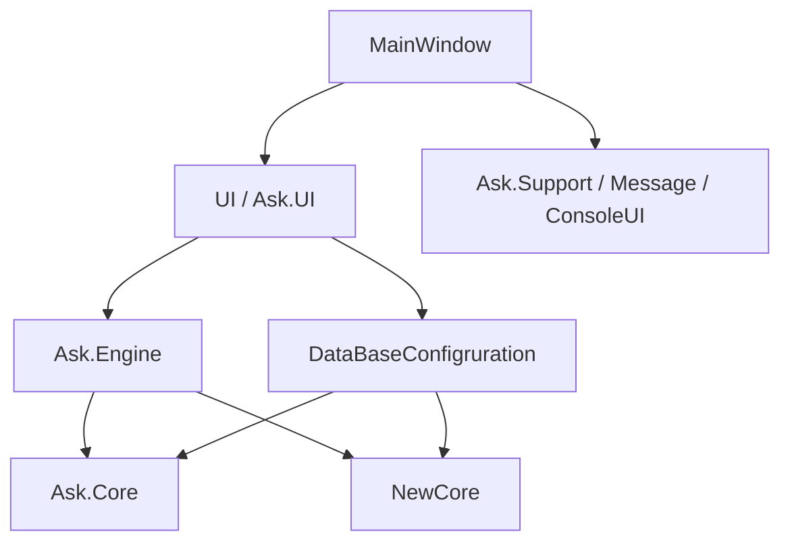

# Обзор решения

## Что такое AskMkiM

`AskMkiM` — это инженерное Windows-приложение для системы `АСК-МКИ-М`.

В рабочем режиме мы используем его сразу в нескольких ролях:

- как редактор программ контроля;
- как транслятор и исполнитель этих программ;
- как среду для режимов метрологии;
- как набор инструментов для самоконтроля и инженерных проверок оборудования;
- как конфигуратор устройств, настроек, протоколов и сервисных режимов.

## Логические слои

## Основные блоки по ответственности

### `MainWindow`

Отвечает за старт приложения и связывание крупных подсистем:

- splash screen;
- single-instance;
- обработка аргументов командной строки;
- регистрация ассоциаций файлов;
- сборка сервисов главного окна;
- запуск жизненного цикла UI.

### `UI`

Это основной WPF-слой:

- текстовый редактор;
- контейнеры вкладок;
- транслятор;
- runner;
- окна настроек;
- контролы метрологии;
- тестовые и сервисные экраны.

### `Ask.UI`

Дополнительный UI-слой:

- локализация;
- уведомления;
- drawer-панель;
- иконки;
- часть новых контролов и overlay-механик.

### `Ask.Engine`

Ядро прикладной логики:

- парсинг языка программ контроля;
- пост-анализ команд;
- исполнение команд;
- обработка точек останова;
- метрологические алгоритмы;
- методные и узловые проверки;
- тесты релейной коммутации;
- самоконтроль.

### `NewCore`

Слой работы с оборудованием:

- описания устройств;
- протоколы связи;
- менеджеры точек, шин, напряжения, тока и т.д.;
- self-check оборудования;
- адаптеры для подключения логики к интерфейсам.

### `DataBaseConfigruration`

Слой данных и конфигурации:

- SQLite;
- Entity Framework Core;
- миграции;
- загрузка и сохранение настроек;
- загрузка и сохранение конфигурации устройств;
- seed-данные.

### `Ask.Support`, `Message`, `ConsoleUI`, `Ask.LogLib`

Служебные подсистемы:

- встроенная справка;
- пользовательские сообщения;
- консольные команды;
- логирование.

## Ключевые сценарии системы

### 1. Работа с программой контроля

Путь:

- открыть файл;
- отредактировать;
- транслировать;
- проверить ошибки;
- запустить;
- получить протокол.

### 2. Метрологический режим

Путь:

- открыть нужный режим из меню;
- подключить и проверить оборудование;
- настроить коммутацию;
- настроить измеритель;
- выполнить измерение;
- получить результат и погрешность.

### 3. Проверка оборудования

Путь:

- открыть тестовый экран;
- выбрать модули и точки;
- запустить тест;
- смотреть сообщения, ошибки и состояние устройств.

## Что важно для нового разработчика

- Система выросла вокруг реального оборудования, поэтому в репозитории рядом живут production-код, инженерные проверки и служебные утилиты.
- Не все механизмы зарегистрированы явно. Для команд, форматов и метрологических режимов часто используется автоматическое обнаружение через reflection.
- Для правильного понимания проекта мало смотреть только `MainWindow`. Значимая логика распределена между `UI`, `Ask.Engine`, `NewCore` и `DataBaseConfigruration`.
