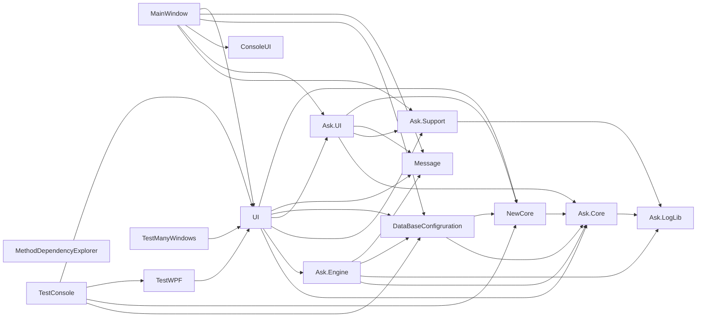

# Зависимости проектов

## Граф зависимостей

## Что из этого следует

### Верхний уровень

- `MainWindow` — точка входа и хост верхнего уровня.
- `UI` — основной пользовательский слой.
- `Ask.UI` — дополнительный UI-слой, который уже используется `UI` и `MainWindow`.

### Общие основания

- `Ask.Core` — фундамент общих интерфейсов, моделей и конфигураций.
- `NewCore` — инфраструктура работы с устройствами поверх `Ask.Core`.
- `DataBaseConfigruration` — слой хранения конфигурации, опирающийся на `Ask.Core` и `NewCore`.

### Прикладная логика

- `Ask.Engine` зависит от `Ask.Core`, логирования, базы и сообщений.
- Это значит, что движок не является полностью чистым доменным слоем: он уже знает про данные и про пользовательский вывод.

## Таблица ролей проектов

| Проект | Роль | Тип |
| --- | --- | --- |
| `MainWindow` | запуск и сборка главного окна | WinExe |
| `UI` | основной WPF UI | Library |
| `Ask.UI` | дополнительные UI-компоненты | Library |
| `Ask.Engine` | трансляция, исполнение, тесты, метрология | Library |
| `NewCore` | устройства, протоколы, менеджеры | Library |
| `Ask.Core` | общие интерфейсы, DTO, конфиг и метаданные | Library |
| `DataBaseConfigruration` | SQLite, EF Core, сервисы настроек и устройств | Library |
| `Ask.Support` | встроенная справка и вспомогательные механизмы | Library |
| `Message` | кастомные окна сообщений | Library |
| `ConsoleUI` | встроенная консоль и команды | Library |
| `Ask.LogLib` | логирование | Library |
| `TestConsole` | ручные инженерные сценарии | Exe |
| `TestWPF` | тестовая WPF-песочница | WinExe |
| `TestManyWindows` | экспериментальный многооконный UI | WinExe |
| `MethodDependencyExplorer` | Roslyn-утилита для анализа файла | Exe |

## Сильные сцепления

На что стоит обратить внимание:

- `UI` зависит почти от всего прикладного стека.
- `MainWindow` напрямую зависит от `UI`, `Ask.UI`, базы, справки, сообщений и консоли.
- `Ask.Engine` знает и про базу, и про сообщения, поэтому изолировать его в отдельный чистый пакет будет непросто.

## Архитектурные особенности

### Плюсы

- логика разделена по ответственности достаточно понятно;
- устройства и бизнес-алгоритмы физически вынесены из UI;
- тестовые приложения не смешаны с основным `MainWindow`.

### На что смотреть осторожно

- в проекте два UI-слоя;
- есть статические сервисы и глобальные конфигурации;
- часть поведения строится через reflection и события, поэтому не всегда есть одна явная точка входа.
