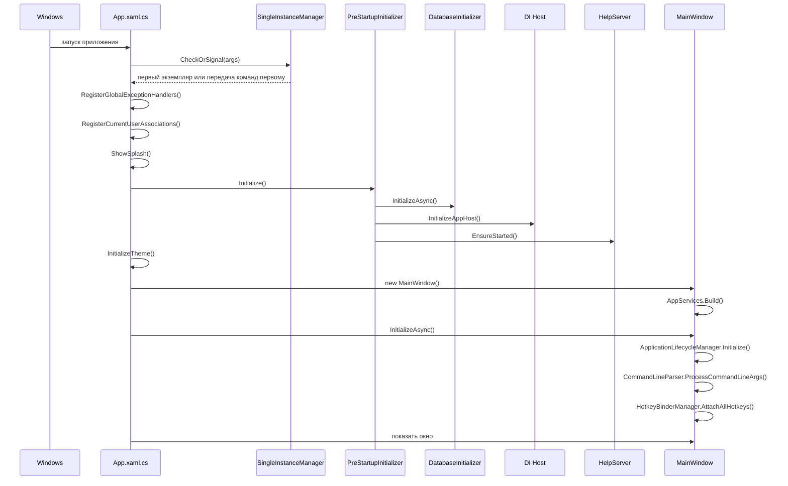

# Запуск и жизненный цикл

## Главная точка входа

Основная точка входа приложения — `MainWindow/App.xaml.cs`.

Именно здесь начинается:

- проверка single-instance;
- регистрация глобальных обработчиков ошибок;
- инициализация темы и языка;
- подготовка базы;
- запуск help-сервера;
- создание и показ главного окна.

## Алгоритм старта

## Детали по шагам

### 1. Single-instance

`SingleInstanceManager`:

- создает глобальный mutex;
- поднимает `NamedPipeServerStream` для первого экземпляра;
- если приложение уже запущено, передает команду `ACTIVATE` и список файлов на открытие;
- второй экземпляр после этого завершается.

### 2. Глобальные ошибки

В `App` регистрируются:

- `DispatcherUnhandledException`;
- `AppDomain.CurrentDomain.UnhandledException`;
- `TaskScheduler.UnobservedTaskException`.

При фатальных проблемах приложение пишет отчет в `CrashReports`.

### 3. Предстартовая инициализация

`PreStartupInitializer.Initialize()` делает три больших шага:

- инициализирует базу;
- поднимает `IHost` и DI;
- запускает help-сервер.

### 4. База и прогрев конфигурации

`DatabaseInitializer.InitializeAsync()`:

- вызывает `DataBaseConfig.InitializeDB()`;
- прогревает кэши сервисов устройств;
- загружает настройки протокола, выполнения, интерфейса и отображения устройств;
- подписывает save-события на обратную запись в SQLite.

### 5. DI и сервисы приложения

`PreStartupInitializer.InitializeAppHost()` регистрирует:

- `Dispatcher`;
- `IBreakdownTester`;
- `BreakdownTesterServices`;
- `IUsbMonitorView`;
- `MetrologyControlFactory`.

Дополнительно отдельно регистрируются контролы метрологических режимов через reflection по атрибуту `MetrologyModeAttribute`.

### 6. Справка

`HelpServer.EnsureStarted()`:

- ищет папку `AppHelp`;
- поднимает локальный `Kestrel` на `localhost`;
- раздает HTML/CSS/JS из встроенной справки.

### 7. Создание главного окна

Конструктор `MainWindow`:

- вызывает `AppServices.Build(this)`;
- собирает `MainWindowViewModel`;
- подключает `HelpProvider`;
- включает обработку темы, хоткеев и состояния UI.

`InitializeAsync()` затем:

- связывает жизненный цикл приложения;
- обрабатывает аргументы командной строки;
- подписывает message-события;
- подключает хоткеи.

## Обработка командной строки

`CommandLineParser` поддерживает:

- `admin`;
- `debug`;
- путь к файлу поддерживаемого типа.

Поддерживаемые расширения перечислены в `SupportedFileExtensions`.

## Завершение работы

В `OnExit` приложение:

- пытается отключить `IBreakdownTester`;
- закрывает окно справки;
- останавливает help-сервер;
- снимает блокировку удержания экрана;
- запускает сборку мусора.

## Что полезно помнить при отладке старта

- до показа главного окна уже успевают отработать база, DI и справка;
- часть файлов открывается не напрямую в `App`, а через `ApplicationActivator` и pipe-команды;
- если окно не открывается, смотреть нужно не только `MainWindow`, но и `PreStartupInitializer`, `DatabaseInitializer`, `HelpServer`, `AppServices`.
