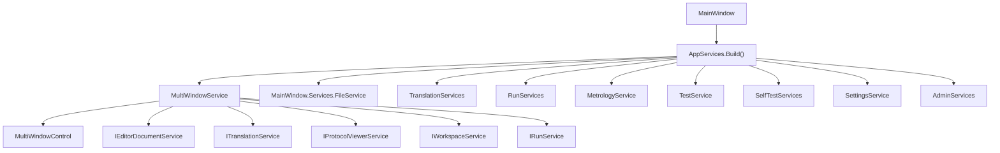
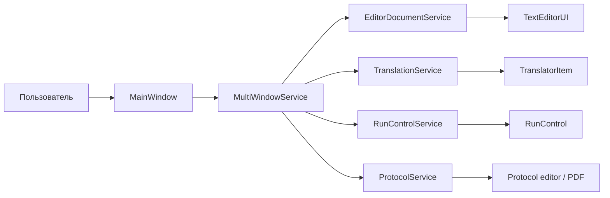

# UI и рабочее пространство

## Общая идея

UI в проекте состоит из двух уровней:

- `MainWindow` — хост верхнего уровня и orchestration;
- `UI` и `Ask.UI` — основная библиотека контролов, редакторов, панелей, overlay-механик и сервисов рабочего пространства.

## Главный объект композиции

`MainWindowViewModel` делит функциональность на крупные разделы:

- `File`;
- `Translation`;
- `Run`;
- `Metrology`;
- `Test`;
- `SelfTest`;
- `Settings`;
- `Admin`;
- `Window`.

## Как собирается UI-граф

## Рабочее пространство редактора

Центральный узел в UI-библиотеке — `UI.Components.MultiEditorMethods.FileManager`.

Он собирает:

- `ContainerService`;
- `ProtocolService`;
- `ControlManagerService`;
- `DockItemService`;
- `FolderService`;
- `RunControlService`;
- `TextEditorService`;
- `TranslationService`;
- `FileService`.

Важно: в проекте есть два класса с похожим названием:

- `MainWindow.Services.FileService` — orchestration со стороны главного окна;
- `UI.Services.FileManager.FileService` — документный сервис редактора.

Это одна из точек, где новичкам проще всего запутаться.

## Основные UI-сущности

### `TextEditorUI`

Главный редактор текста:

- работает на `AvalonEdit`;
- умеет подсветку синтаксиса;
- поддерживает foldings;
- умеет точки останова;
- умеет маркеры и навигацию по строкам.

### `TextEditorContainer`

Контейнер вкладок определенного типа.

Типы редакторных зон задаются через `EditorType`:

- текстовый редактор;
- транслятор;
- runner;
- протокол.

### `TranslatorItem`

Состоит из двух редакторов:

- левый — исходный файл;
- правый — результат трансляции.

### `RunControl`

Экран исполнения:

- хранит список моделей команд;
- показывает `ProtocolUI`;
- отображает ошибки;
- держит слева редактор / транслятор;
- запускает `CommandExecutionManager`.

## Сервисная схема рабочего пространства

## Меню и маршрутизация по разделам

`MainWindow` не держит всю логику внутри code-behind.

Меню в основном окне отправляет пользователя в сервисы:

- `MetrologyService` — открывает метрологические контролы;
- `TestService` — открывает тестовые экраны;
- `SelfTestServices` — открывает самоконтроль;
- `SettingsService` — открывает настройки и справку;
- `AdminServices` — открывает административные панели;
- `TranslationServices` — строит и запускает программы контроля.

## Что важно для UI-отладки

- Если вкладка не открылась, чаще всего смотреть нужно в `MultiWindowService`, `ControlManagerService`, `DockItemService` и `ContainerService`.
- Если сломалась логика runner/translator, проблема может быть не в контроле, а в orchestration-сервисах главного окна.
- Overlay-поведение и уведомления живут в `Ask.UI`, поэтому не все визуальные эффекты надо искать в `UI`.
