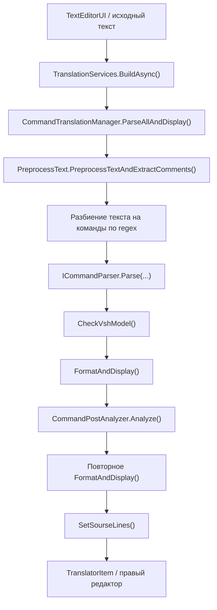

# Язык команд и трансляция

## Назначение слоя

Слой трансляции отвечает за путь:

- взять исходный текст программы контроля;
- разбить его на команды;
- построить модели команд;
- проверить структуру и взаимосвязи;
- сформировать форматированный результат;
- показать ошибки и предупреждения в UI.

## Основные файлы и точки входа

- `MainWindow/Services/TranslationServices.cs`
- `Ask.Engine/ControlCommandAnalyser/CommandTranslationManager.cs`
- `Ask.Engine/ControlCommandAnalyser/Parser`
- `Ask.Engine/ControlCommandAnalyser/Formatter`
- `Ask.Engine/ControlCommandAnalyser/ComandBody`

## Какие файлы считаются входом

В рабочем процессе трансляция обычно начинается из файлов:

- `.pk`
- `.pkw`
- `.acs`

Результат трансляции отображается как `.opkw`.

## Общий алгоритм трансляции

## Как `CommandTranslationManager` собирает обработчики

В конструкторе менеджер через reflection находит:

- все `ICommandParser`;
- все `ICommandFormatter`;
- все `ICommandBody`.

Это важно по двум причинам:

- нет одного центрального switch по всем командам;
- новый парсер или форматтер автоматически попадет в цепочку, если реализует нужный интерфейс.

## Как текст превращается в список команд

`ParseAll(text)` делает следующее:

1. Предобрабатывает текст и вынимает комментарии.
2. Идет по строкам в порядке номера строки.
3. Ищет начало команды по regex:
   `^\s*(\d+)\s+([А-ЯA-Z]{2,})\b`
4. Собирает блок строк, относящийся к текущей команде.
5. Вызывает `ParseSingle(...)`.
6. Если парсер не найден, создает `UnknownCommandModel`.

## Пост-анализ после парсинга

`CommandPostAnalyzer` проверяет:

- первая команда должна быть `ОК`;
- последняя команда должна быть `КЦ`;
- обязательные мнемоники `ОК`, `РМ`, `СП`, `КЦ` не должны дублироваться;
- у `УП` должна быть корректная метка перехода;
- в карте `РМ` не должно быть повторяющихся конечных точек.

## Автоматическое добавление `ВШ`

Если в программе нет команды `ВШ`, `CommandTranslationManager.CheckVshModel()` может добавить ее автоматически после `РМ`.

Это нужно учитывать при отладке:

- итоговая модель команд может отличаться от исходного текста;
- пользователь мог не писать `ВШ` руками.

## Разбор точек и схем

Одна из самых насыщенных частей — `PointParser`.

Он умеет:

- разбирать блоки `*...*`;
- различать цепи, разделенные `*`;
- различать части одной цепи, разделенные `#`;
- раскрывать диапазоны;
- обрабатывать специальные случаи диапазонов через `-*`;
- валидировать запреты для отдельных режимов, например для `КС`.

## Разбор ключей алгоритма

`AlgorithmKeyParser`:

- извлекает ключи алгоритмов из строки;
- проверяет их допустимость для конкретной модели команды;
- различает разрешенные и запрещенные ключи.

## Форматирование и отображение

После парсинга и после анализа команды форматируются повторно.

Задачи этого шага:

- построить текст правого редактора;
- вычислить соответствие строк исходник → трансляция;
- проставить `FormattedLineNumber` для ошибок и предупреждений;
- подготовить `SourceLines` в окончательном виде.

## Как трансляция связана с UI

`TranslationServices`:

- берет активный редактор;
- создает или обновляет `TranslatorItem`;
- передает исходный текст в `CommandTranslationManager`;
- настраивает точки останова в исходном и правом редакторе;
- если нужно, потом удаляет translator-вкладку и создает `RunControl`.

## Что важно при расширении языка

Если нужно добавить новую команду, обычно приходится трогать:

- модель команды;
- парсер;
- форматтер;
- body-builder при необходимости;
- executor, если команда исполняемая;
- подсветку синтаксиса;
- справку и примеры программ.
