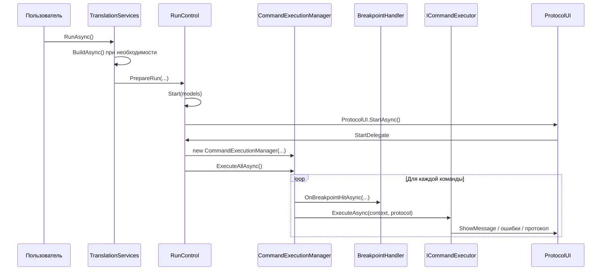

# Исполнение программ контроля

## Назначение слоя

Этот слой берет уже построенные модели команд и выполняет их по очереди с учетом:

- точек останова;
- пошагового режима;
- переходов;
- пользовательских сообщений;
- протокола выполнения;
- ошибок и аварийных сценариев.

## Главные классы

- `UI/Controls/Runner/RunControl.xaml.cs`
- `Ask.Engine/ControlCommandExecutor/Execution/CommandExecutionManager.cs`
- `Ask.Engine/ControlCommandExecutor/Execution/CommandExecutorRegistry.cs`
- `Ask.Engine/ControlCommandExecutor/Execution/BreakpointHandler.cs`
- `Ask.Engine/ControlCommandExecutor/Execution/EquipmentService.cs`
- `Ask.Engine/ControlCommandExecutor/Execution/CommandExecutionContext.cs`

## Где смотреть алгоритмы конкретных команд

Общая механика движка описана на этой странице, а подробные алгоритмы работы каждого `executor` вынесены отдельно:

- [Алгоритмы исполнителей команд](./12-command-executor-algorithms.md)

## Как runner запускает движок

## Что делает `RunControl`

`RunControl`:

- получает список `TranslationModels`;
- строит экран выполнения на базе `ProtocolUI`;
- показывает список ошибок;
- держит рядом редактор и панель состояния оборудования;
- создает `CommandExecutionManager` и передает ему:
  - `ProtocolUI` как `IUserInteractionService`;
  - активный редактор;
  - список команд;
  - путь к `.opk/.opkw`.

## Что делает `CommandExecutionManager`

`ExecuteAllAsync()`:

1. Проходит по списку команд.
2. Подсвечивает активную строку в редакторе.
3. Проверяет, не сработала ли точка останова.
4. Создает `CommandExecutionContext`.
5. Ищет executor по мнемонике через `CommandExecutorRegistry`.
6. Выполняет команду.
7. Обрабатывает переходы по `УП`.
8. При исключении пытается аварийно выполнить `КЦ`.

## Реестр исполнителей

`CommandExecutorRegistry` автоматически находит все реализации `ICommandExecutor` в сборке.

Следствие:

- новые executors не нужно регистрировать вручную в одном месте;
- мнемоника команды становится ключом в реестре.

## Контекст выполнения

`CommandExecutionContext` дает исполнителю доступ к:

- текущей команде;
- консоли / пользовательскому интерфейсу;
- редактору;
- менеджеру выполнения;
- переходу к другой команде;
- пути к OPK-файлу;
- дополнительным metadata.

## Точки останова и пошаговый режим

`BreakpointHandler`:

- показывает заголовок команды, на которой сработал breakpoint;
- переводит систему в step mode;
- ждет действий пользователя;
- умеет открыть drawer со списком команд;
- возвращает выбранную команду или оставляет текущую.

`StepControlManager` управляет:

- ручным пошаговым режимом;
- режимом step-into;
- режимом step-over;
- обходом до следующей управляющей команды;
- режимом, активированным именно точкой останова.

## Валидация и подготовка оборудования

`EquipmentService` проверяет и подготавливает окружение:

- существование шасси;
- наличие устройства коммутации;
- наличие релейных модулей;
- допустимость номеров точек;
- инициализацию и reset модулей и переключателей.

Этот сервис важен, потому что отделяет:

- логическую команду;
- реальную конфигурацию оборудования.

## Ошибки и аварийный путь

Если команда падает с исключением, `CommandExecutionManager`:

- пишет сообщение в UI;
- пытается аварийно выполнить `КЦ`;
- защищается от рекурсивного повторного входа.

## Что важно при отладке исполнения

- Если команда не выполняется, сначала проверить, был ли найден executor.
- Если исполнение “перескочило”, смотреть `JumpToCommandNumber` и логику `УП`.
- Если runner открывается, но ничего не происходит, смотреть связку `RunControl` → `ProtocolUI` → `StartDelegate`.
- Если выполнение рушится до команды, смотреть `EquipmentService` и корректность конфигурации устройств.
