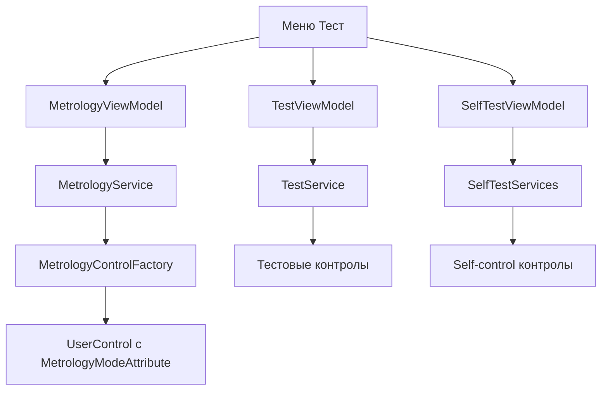
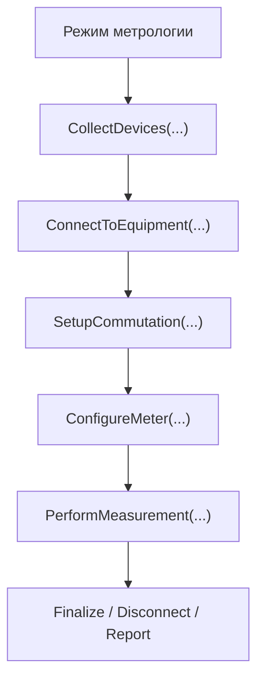

# Метрология и проверки оборудования

## Почему это отдельный большой блок

В проекте метрология и прикладные проверки оборудования — это не второстепенный раздел.

Здесь есть отдельные:

- режимы метрологии;
- узловые и групповые методы;
- проверки релейной коммутации;
- самоконтроль модулей;
- самоконтроль системы;
- ручные инженерные утилиты.

## Как пользователь попадает в эти режимы

## Метрологические режимы

Сейчас в системе есть режимы:

- `КС`
- `ИЕ`
- `СИ`
- `ПР`
- `ПИ (DCW)`
- `ПИ (ACW)`
- `КН (DCW)`
- `КН (ACW)`
- `ЭТ`

Для них используются контролы из:

- `UI/Controls/ExecutorControls/MetrologyControls`

А логика тестов лежит в:

- `Ask.Engine/Tests/Metrology`

## Как подключаются метрологические контролы

`MetrologyControlFactory` не хранит жестко зашитый список режимов.

Он:

- сканирует загруженные сборки;
- ищет `UserControl`, помеченные `MetrologyModeAttribute`;
- строит карту `MetrologyType -> (control, title)`;
- создает контрол через DI.

Это значит, что добавление нового режима не требует переписывать одну центральную таблицу в фабрике.

## Базовый алгоритм измерения

Центральный шаблон находится в `Ask.Engine/Tests/Metrology/MeasurementSystem/BaseMeasurement.cs`.

Это template-method для метрологических режимов.

## Что делает `BaseMeasurement`

Базовый класс умеет:

- собрать нужные устройства по точкам и режиму;
- подключить их;
- настроить коммутацию;
- настроить измеритель;
- выполнить измерение через абстрактный метод;
- накопить список измерений;
- выдать итоговые результаты и погрешности.

## Какие устройства могут потребоваться

В зависимости от режима алгоритм может подтягивать:

- релейные модули;
- устройство коммутации;
- быстрый мультиметр;
- пробойную установку;
- модуль источника напряжения и тока.

## Другие ветки тестов в `Ask.Engine/Tests`

### `MethodExecutor`

Групповые методы:

- `CI`
- `PI ACW`
- `PI DCW`

### `NodeMethod`

Узловые методы:

- `CI`
- `PI ACW`
- `PI DCW`

### `RelaySwitchingModule`

Прикладные проверки модулей коммутации:

- `CrossConnectionTests`
- `RkommConnectionTests`

### `SelfControl`

Самоконтроль:

- `ModuleSelfExecutor`
- `SystemSelfExecutor`

## Пример прикладного теста оборудования

`CrossConnectionTests`:

- валидирует ввод;
- находит тестируемый и проверяющий модули;
- инициализирует их;
- включает измеритель;
- запускает несколько частей теста;
- при остановке делает reset модулей.

Это хороший пример того, как прикладная инженерная проверка вынесена в отдельный алгоритм, а не смешана с общим исполнительным циклом программ контроля.

## Что важно при расширении метрологии

- UI режима и алгоритм режима — это разные сущности.
- Меню и ViewModel открывают контрол, но не содержат сам алгоритм измерения.
- Реальная логика лежит в `Ask.Engine/Tests`.
- Если нужен новый режим, важно добавить не только контрол, но и алгоритм, настройки ввода и сообщения пользователю.
