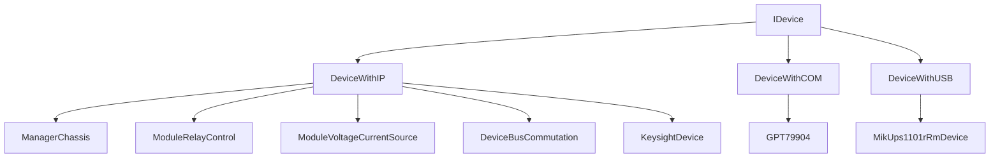

# Устройства и коммуникация

## Общая модель

В проекте устройства описываются в `Ask.Device.Runtime` и конфигурируются через `DataBaseConfigruration`.

Схема по слоям такая:

- `Ask.Core` задает интерфейсы устройств;
- `Ask.Device.Runtime/Device` задает конкретные классы;
- `Ask.Device.Communication` задает универсальные transport-протоколы;
- `Ask.Device.Runtime/Function` задает менеджеры и прикладные действия;
- `DataBaseConfigruration/Services/Device` загружает и сохраняет конфигурацию устройств.

## Иерархия устройств

## Конкретные типы оборудования

Сейчас в проекте есть:

- `ManagerChassis`
- `ModuleRelayControl`
- `ModuleVoltageCurrentSource`
- `DeviceBusCommutation`
- `KeysightDevice`
- `GPT79904`
- `MikUps1101rRmDevice`

## Протоколы связи

В `Ask.Device.Communication` используются:

- `ComProtocol`
- `UdpProtocol`
- `TcpProtocol`
- `UsbProtocol`

## Как связываются устройство и протокол

### COM-устройства

`DeviceWithCOM`:

- хранит `SerialPort`;
- умеет восстанавливать порт из `ConnectionDetails`;
- автоматически создает `ComProtocol`.

### IP-устройства

`DeviceWithIP`:

- хранит `IPAddress`;
- по умолчанию создает `UdpProtocol`;
- конкретное устройство может назначить `TcpProtocol`, если общается по TCP.

### USB-устройства

`DeviceWithUSB`:

- хранит строку подключения;
- использует `UsbProtocol`;
- бизнес-логика конкретного USB-устройства выносится в `IUsbCommandHandler` уже в runtime-слое.

## Менеджеры функций

Большая часть прикладных действий на устройствах вынесена в менеджеры.

Примеры:

- для `ModuleRelayControl`:
  - `PointManager`
  - `BusManager`
  - `MeterManager`
  - `StateManager`
  - `SelfTestManager`
- для `ModuleVoltageCurrentSource`:
  - `VoltageManager`
  - `CurrentManager`
  - `BusManager`
  - `StateManager`
  - `SelfTestManager`
- для `DeviceBusCommutation`:
  - `RelayManager`
  - `ResistorManager`
  - `CapacitorManager`
  - `ConnectorManager`
  - `StateManager`
- для `GPT`:
  - `ConnectableManager`
  - командные менеджеры режимов

## Адаптеры

В `Ask.Device.Runtime/FunctionAdapters` есть адаптеры для приведения внутренних менеджеров к интерфейсам из `Ask.Core`.

Это полезно, потому что:

- UI и Engine работают через интерфейсы;
- concrete-логика устройства остается в `Ask.Device.Runtime`.

## Где хранится конфигурация устройств

В `DataBaseConfigruration` есть сервисы:

- `ChassisManagerServices`
- `RelaySwitchModuleServices`
- `PowerSourceModuleServices`
- `SwitchingDeviceServices`
- `FastMeterServices`
- `BreakdownTesterServices`
- `RackServices`
- `UninterruptiblePowerSupplyServices`

Они поднимают устройства из SQLite-конфигурации.

## Подключение и reset

Многие алгоритмы используют единый контракт `IConnectable`.

Из него вызываются действия вида:

- `InitializeAsync`
- `ConnectAsync`
- `DisconnectAsync`
- `ResetAsync`

Именно через эти методы движок и метрология приводят оборудование в рабочее состояние.

## Что важно при отладке устройств

- Если устройство “есть в коде”, но не находится в сценарии, сначала проверять базу и сервисы `DataBaseConfigruration`.
- Если устройство найдено, но не отвечает, смотреть `ConnectionDetails`, конкретный `IDeviceProtocol` и `ConnectableManager`.
- Для проверок оборудования значимы не только сами устройства, но и корректность привязки точек, шин и номеров модулей.
