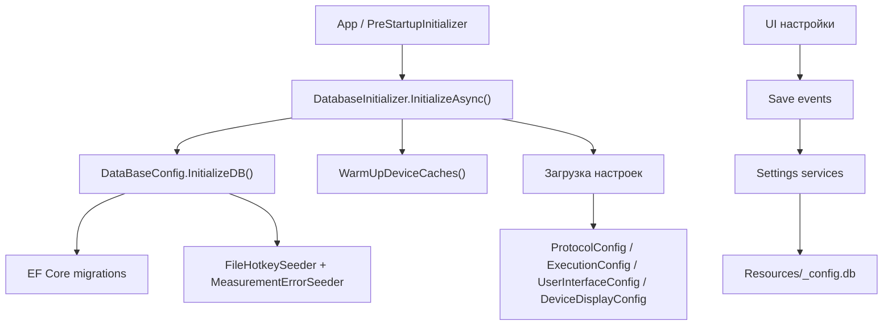

# База данных и настройки

## Общая идея

Проект использует локальную SQLite-базу как центр конфигурации.

В ней хранятся:

- устройства;
- настройки выполнения;
- настройки интерфейса;
- настройки протокола;
- настройки отображения устройств;
- горячие клавиши;
- таблицы погрешностей измерений.

## Ключевые файлы

- `DataBaseConfigruration/DataBaseConfig.cs`
- `DataBaseConfigruration/Context/AppDbContext.cs`
- `MainWindow/Init/DatabaseInitializer.cs`
- `DataBaseConfigruration/Services/Settings/*`
- `DataBaseConfigruration/Services/Device/*`

## Путь запуска базы

## Как находится файл базы

`DataBaseConfig.ConfigFilePath` ищет `_config.db` в нескольких местах:

- рядом с приложением;
- в ожидаемой папке сборки;
- в build-пути проекта базы.

Если ничего не найдено, создается локальный путь рядом с приложением.

## Что делает `InitializeDB()`

- применяет миграции;
- вызывает `EnsureCreated`;
- выполняет seed горячих клавиш;
- выполняет seed таблицы погрешностей;
- подключает провайдера погрешностей.

## Контекст базы

`AppDbContext` разбит partial-классами на несколько областей:

- `Settings`
- `Device`
- `Measurement`

Это удобно, потому что таблицы сгруппированы по смыслу, а не лежат одной большой стеной.

## Сервисы настроек

Основные сервисы:

- `ProtocolService`
- `ExecutionService`
- `UserInterfaceService`
- `DeviceDisplayService`

На старте `DatabaseInitializer`:

- читает значения из базы;
- записывает их в статические config-менеджеры;
- подписывает save-события обратно на базу.

## Статические config-менеджеры

В рантайме приложение много где работает не напрямую с EF, а через статические конфигурации:

- `ProtocolConfig`
- `ExecutionConfig`
- `UserInterfaceConfig`
- `DeviceDisplayConfig`

Это упрощает доступ к настройкам, но добавляет глобальное состояние.

## Что хранится в таблицах устройств

База знает про:

- шасси;
- релейные модули;
- модуль источника напряжения и тока;
- коммутационные устройства;
- быстрые измерители;
- пробойные установки;
- стойки;
- UPS.

## Что важно для разработчика

- Новый тип конфигурации обычно требует не только model-класс, но и сервис чтения/сохранения, инициализацию на старте и, как правило, миграцию EF.
- Много сценариев в Engine и Metrology ожидают, что конфигурация оборудования уже есть в базе.
- Если UI “не видит” настройку, проблема может быть не в контроле, а в разрыве между EF service и статическим config-менеджером.
