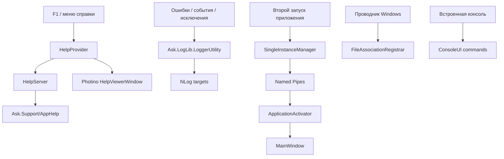

# Служебные подсистемы

## Что входит в этот слой

Вокруг основного приложения есть несколько важных сервисов:

- встроенная справка;
- логирование;
- консольные команды;
- single-instance;
- активация уже открытого окна;
- ассоциации файлов.

## Карта служебных подсистем

## Справка

Справочная система состоит из трех частей:

- `HelpServer` — локальный `Kestrel`, который раздает HTML;
- `HelpViewerWindow` — окно на `Photino.NET`;
- `HelpProvider` — механизм привязки `F1` к визуальным элементам.

Как это работает:

1. `HelpServer.EnsureStarted()` поднимает `localhost`.
2. `HelpProvider.RegisterHelp(window)` запоминает последний hovered/focused элемент.
3. При `F1` определяется `HelpKey`.
4. `HelpViewerWindow.LoadAndShow(...)` открывает нужную страницу.

## Логирование

`Ask.LogLib.LoggerUtility`:

- оборачивает `NLog`;
- автоматически добавляет путь к файлу и номер строки;
- умеет писать `Info`, `Warn`, `Error`, `Debug`;
- умеет логировать исключения.

Дополнительно:

- аварийные ошибки пишутся в `CrashReports`;
- console-output перенаправляется в `ConsoleTextManager`.

## Single-instance и активация окна

`SingleInstanceManager`:

- держит глобальный mutex;
- запускает pipe-server;
- принимает команды `ACTIVATE` и `OPENFILE|...`.

`ApplicationActivator`:

- активирует главное окно;
- передает файл в уже запущенный экземпляр;
- хранит очередь отложенных открытий до момента, когда окно готово.

## Ассоциации файлов

`FileAssociationRegistrar`:

- регистрирует `ProgId`;
- записывает команду открытия;
- связывает расширения `.pk`, `.pkw`, `.opk`, `.opkw`, `.lst`, `.lstw`, `.acs` с текущим exe.

## Встроенная консоль

`ConsoleUI` добавляет служебные команды:

- `admin`
- `debug`
- `add-log`
- `clear`
- `del-admin`
- `echo`
- `exit`
- `help`
- `logs`
- `logs-split`

Эта консоль нужна для обслуживания и отладки, а не как основной пользовательский интерфейс.

## Что полезно помнить

- Если не открывается справка, смотреть нужно и `HelpServer`, и `HelpViewerWindow`, и существование папки `AppHelp`.
- Если второй экземпляр не передает файл первому, проверять нужно mutex, pipes и `SupportedFileExtensions`.
- Если проводник не открывает файл приложением, смотреть `FileAssociationRegistrar` и actual path к exe.
