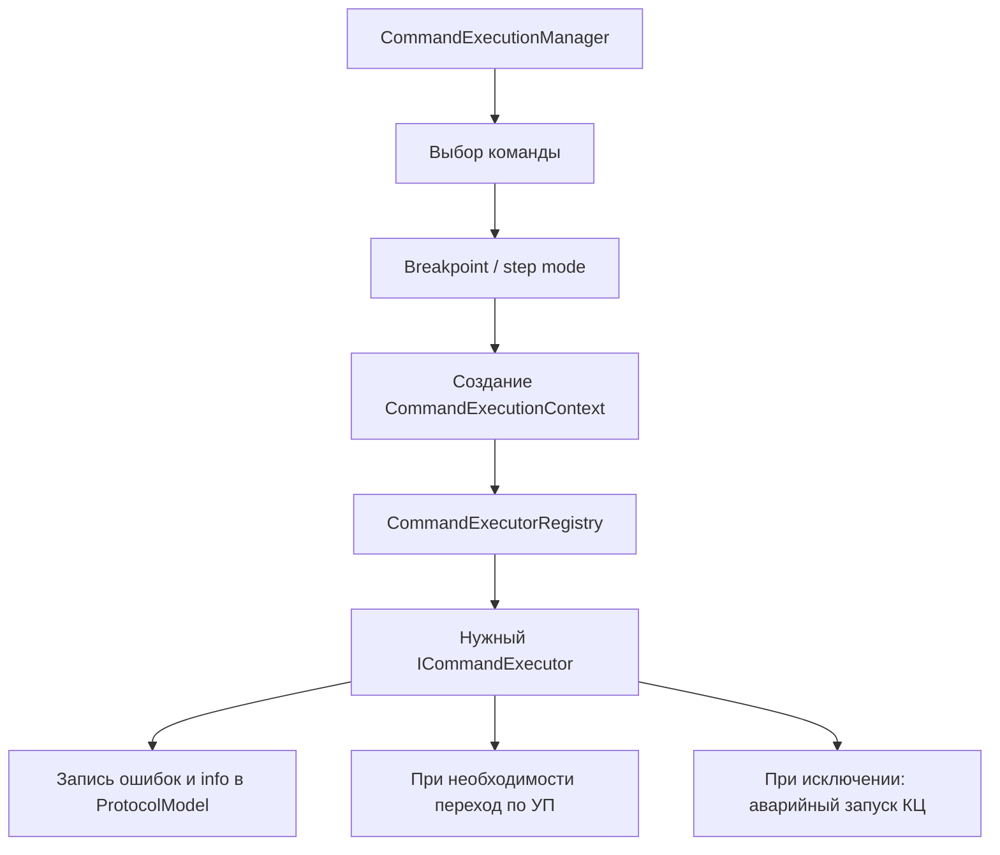
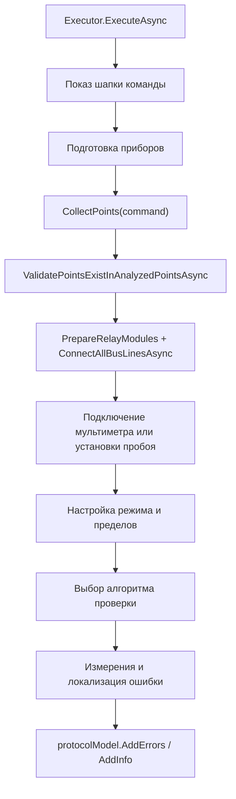

# Алгоритмы исполнителей команд

## Зачем эта страница

Эта страница описывает не синтаксис команд, а именно то, как они выполняются в слое `Ask.Engine/ControlCommandExecutor/Executors`.

То есть здесь мы отвечаем на вопрос:

- что делает `executor`, когда команда уже распознана и превращена в модель;
- какие общие шаги повторяются почти у всех команд;
- какие ветки выполнения выбираются по `AlgorithmKey`;
- что именно попадает в протокол;
- какие команды реально что-то делают, а какие пока служат только маркером.

## Общая оболочка выполнения

До вызова конкретного `executor` общую рамку строит `CommandExecutionManager`:

1. берет следующую команду из списка;
2. подсвечивает текущую строку в редакторе;
3. проверяет breakpoint и пошаговый режим;
4. создает `CommandExecutionContext`;
5. находит нужный `executor` по мнемонике через `CommandExecutorRegistry`;
6. вызывает `ExecuteAsync(...)`;
7. после выполнения обновляет флаг брака `LastRejectFlag`;
8. если во время команды случилось исключение, пытается аварийно выполнить `КЦ`.

## Общий шаблон измерительной команды

Большинство измерительных `executor`-ов работают по одному и тому же каркасу:

1. показывают шапку выполнения команды;
2. при необходимости выводят сообщение о подготовке приборов;
3. собирают точки из схемы команды;
4. проверяют, что эти точки были заранее разобраны и разрешены;
5. находят задействованные релейные модули;
6. подключают линии шин;
7. подключают измерительный прибор через коммутатор;
8. настраивают прибор в нужный режим;
9. выбирают конкретный алгоритм проверки;
10. выполняют измерения;
11. складывают ошибки и информационные сообщения в `ProtocolModel`.

## Что означают ключи алгоритмов

Часть команд выбирает способ проверки по `AlgorithmKey`.

- `К` — метод полного узла.
- `Г` — групповой метод.
- `Т1` — проверка относительно первой точки.
- если специальных ключей нет — используется метод накапливающего узла.
- `И` — выполнить еще один проход с инверсией полярности.
- `Д` — записывать промежуточные измерения в протокол как информационные сообщения.
- `Б` — для `КС` использовать режим прозвонки, а не обычное измерение сопротивления.
- `ЗС` — для `ПР` пропустить часть проверки соединенных цепей.
- `ЗР` — для `ПР` пропустить часть проверки разобщения.

## Организационные команды

### `ОК`

Команда старта программы контроля.

Алгоритм исполнения:

1. вызывает `ResetAllSystem()` и тем самым сбрасывает состояние системы перед началом;
2. очищает список ошибок выполнения через `ClearErrorsMethod()`;
3. берет модель `OkCommandModel`;
4. подсвечивает строку команды;
5. создает новый `ProtocolModel` внутри команды;
6. записывает путь программы в `ProgramPath`;
7. выводит шапку вида `Выполнение программы контроля для ...`.

Что важно:

- именно `ОК` открывает новый логический сеанс выполнения;
- команда не измеряет цепи и не коммутирует точки;
- она готовит начало протокола и сбрасывает старое состояние.

### `РМ`

Команда подготовки карты точек и состава оборудования.

Алгоритм исполнения:

1. выводит шапку команды;
2. берет все точки назначения из `PointsMap`;
3. переводит их в `PointModel`;
4. вызывает `EquipmentService.AnalyzePoints(...)`;
5. определяет, какие измерительные приборы вообще нужны текущей программе;
6. добавляет найденные релейные модули и коммутатор в список активных устройств;
7. если в программе есть команды мультиметра, инициализирует мультиметр;
8. если в программе есть команды установки пробоя, инициализирует ее;
9. публикует список устройств через `ExecutionEventAdapter.RaiseDevicesChanged(...)`.

Что важно:

- `РМ` не запускает измерение;
- `РМ` не соединяет все точки схемы навсегда;
- главная задача команды — проверить адресацию точек и подготовить набор устройств к следующим командам.

### `СП`

В текущем коде это команда-заглушка.

Алгоритм исполнения:

1. берет `CpCommandModel`;
2. только подсвечивает строку;
3. завершает работу без сообщений, коммутации и записи в протокол.

Что важно:

- полноценной логики исполнения для `СП` сейчас нет;
- если в будущем команда должна что-то делать, это место еще нужно развивать.

### `СК`

Команда очистки точек на указанных шинах.

Алгоритм исполнения:

1. выводит шапку команды;
2. проходит по всем валидным релейным модулям;
3. определяет, какие две шины обслуживает модуль;
4. если команда ссылается на шину `A`, отключает все точки от шины `A`;
5. если команда ссылается на шину `B`, отключает все точки от шины `B`.

Что важно:

- команда работает по шинам, а не по индивидуальным точкам;
- это общий сброс коммутации на выбранных направлениях.

### `ВШ`

Команда подключения всех линий шин.

Алгоритм исполнения:

1. выводит шапку команды;
2. берет список валидных релейных модулей;
3. вызывает `ConnectAllBusLinesAsync(...)`.

Что важно:

- команда не занимается измерением;
- она приводит линии шин в рабочее состояние перед дальнейшей коммутацией.

### `ПТ`

Команда кратковременного подключения точек.

Алгоритм исполнения:

1. выводит шапку команды;
2. для каждой шины из `BusPointsDictionary` находит все уникальные модули;
3. сначала подключает нужную шину у каждого модуля;
4. потом подключает нужные реле отдельных точек;
5. если у команды задано время, ждет указанную задержку;
6. после задержки отключает точки;
7. затем отключает саму шину у задействованных модулей.

Что важно:

- `ПТ` сначала включает, потом выключает;
- если времени нет, команда просто подключает точки и не делает автоматический обратный шаг.

### `ОТ`

Зеркальная команда по отношению к `ПТ`.

Алгоритм исполнения:

1. выводит шапку команды;
2. для каждой шины отключает указанные точки;
3. после отключения снимает саму шину с модулей;
4. если задано время, ждет задержку;
5. затем повторно подключает шину и те же точки обратно.

Что важно:

- `ОТ` сначала размыкает, потом при наличии времени восстанавливает соединение;
- по структуре код почти зеркален `ПТ`.

### `ЦУ`

Команда общения с оператором.

Алгоритм исполнения:

1. выводит шапку команды;
2. определяет, является ли текст вопросом;
3. если это не вопрос, показывает информационное окно `OK`;
4. если это вопрос, показывает диалог `Yes / No / Cancel`;
5. если оператор нажал `Cancel`, исполнитель переводит выполнение во временный останов и ждет продолжения;
6. если оператор подтверждает ответ, сохраняет результат в `CommandExecutionState.LastCuResult`;
7. если следующая команда — `УП` и пользователь ответил `No`, ставит `LastRejectFlag = true`.

Что важно:

- `ЦУ` напрямую влияет на поведение `УП`;
- логика перехода строится не в самой `УП`, а через флаг, который выставляет `ЦУ`.

### `УП`

Команда условного перехода.

Алгоритм исполнения:

1. выводит шапку команды;
2. проверяет флаг `CommandExecutionState.LastRejectFlag`;
3. если флаг выставлен, вызывает делегат `JumpToCommandNumber(TargetLabel)`;
4. после этого сбрасывает `LastCuResult`;
5. сбрасывает `LastRejectFlag`.

Что важно:

- сама команда не вычисляет условие;
- она использует результат предыдущего `ЦУ` или предыдущей команды, если та выставила признак брака.

### `КЦ`

Команда завершения программы контроля.

Алгоритм исполнения:

1. выключает пошаговый режим;
2. подписывается на событие закрытия окна ввода реквизитов протокола;
3. выводит шапку команды;
4. сбрасывает все релейные модули;
5. сбрасывает коммутатор;
6. если в программе использовался мультиметр, сбрасывает его;
7. если использовалась установка пробоя, сбрасывает и ее;
8. заполняет поля `ProtocolModel` из `ОК`, текущего времени и пути файла;
9. если генерация протокола включена, поднимает событие запроса реквизитов протокола;
10. после закрытия окна реквизитов дописывает номер, исполнителя, заказчика, режим и открывает просмотр протокола.

Что важно:

- `КЦ` используется и как обычная финальная команда, и как аварийная команда при исключении;
- именно здесь происходит финальный сброс оборудования;
- именно здесь протокол доводится до итогового вида.

## Измерительные команды

### `КС`

Команда проверки сопротивления или прозвонки соединенных цепей.

Алгоритм исполнения:

1. сбрасывает рабочие пределы по умолчанию;
2. выводит шапку команды;
3. показывает сообщение о подготовке приборов;
4. собирает точки из схемы;
5. проверяет, что точки были разобраны после `РМ`;
6. поднимает и подключает нужные релейные модули;
7. подключает мультиметр через коммутатор;
8. переводит мультиметр либо в режим сопротивления, либо в режим прозвонки;
9. берет нижний и верхний пределы из команды;
10. выбирает делегат измерения:
11. если ключ содержит `Б`, используется `FastResistanceMeasure`;
12. иначе используется обычное `ResistanceMeasure`;
13. создает `ConnectedPointContext`;
14. если ключ содержит `Д`, разрешает запись промежуточных измерений в протокол;
15. запускает `ConnectedPointChecker.CheckSequenceAsync(...)`;
16. складывает ошибки и информационные сообщения в `ProtocolModel`.

Как работает базовый алгоритм `ConnectedPointChecker`:

1. берет цепь и оставляет первую точку базовой;
2. подключает базовую точку к одной шине;
3. остальные точки по одной подключает ко второй шине;
4. после каждого измерения решает, точка связана с базовой или нет;
5. успешные точки остаются в рабочем фрагменте;
6. ошибочные точки собираются в новый фрагмент;
7. если фрагмент с ошибками не пустой, алгоритм рекурсивно повторяется уже для него;
8. в итоге исходная цепь раскладывается на фрагменты по местам разрыва.

Что важно:

- для `КС` неудачные измерения еще и отдельно копятся как список значений, чтобы потом показать, где именно была плохая связность;
- если верхний предел не задан, код использует искусственное значение `firstValue + 10`.

### `ИЕ`

Команда проверки емкости.

Алгоритм исполнения почти такой же, как у `КС`, но вместо сопротивления используется емкость.

Основные шаги:

1. выводит шапку команды;
2. подготавливает точки, модули и коммутатор;
3. подключает мультиметр;
4. переводит его в режим измерения емкости;
5. берет нижний и верхний предел из команды;
6. создает `ConnectedPointContext`;
7. запускает `ConnectedPointChecker`;
8. добавляет ошибки и `info` в протокол.

Как происходит одно измерение:

1. исполнитель делает до пяти измерений;
2. положительные результаты складываются в список;
3. потом берется среднее значение;
4. это среднее сравнивается с пределами.

Что важно:

- в текущем коде поле `fixtureCapacitance` присутствует, но внутри этого `executor` не заполняется, поэтому поправка фактически остается нулевой;
- ключ `Д` включает запись промежуточных значений в протокол.

### `ЭТ`

Команда проверки сопротивления методом альтернативной проверки относительно первой точки.

Алгоритм исполнения:

1. выводит шапку команды;
2. подготавливает точки, модули, шины и мультиметр;
3. переводит мультиметр в режим прозвонки;
4. берет пределы сопротивления и поправку кабеля;
5. создает `PairwiseFirstPointAltContext`;
6. при наличии ключа `Д` включает запись `info` в протокол;
7. запускает `PairwiseFirstPointCheckerAlt.CheckSequenceAsync(...)`;
8. складывает ошибки и информационные сообщения в протокол.

Как работает `PairwiseFirstPointCheckerAlt`:

1. берет каждую связную группу из схемы;
2. внутри группы сначала отдельно проверяет базовую точку;
3. потом отдельно проверяет каждую следующую точку;
4. затем измеряет пару `базовая точка + текущая точка`;
5. из итогового сопротивления вычитает среднее из двух одиночных измерений;
6. дополнительно вычитает `CabelResistance`, если режим не холостой;
7. сравнивает итог с границами и формирует ошибку.

Что важно:

- алгоритм умеет отдельно ловить случаи `нет подключения точки`, `перегрузка цепи`, `сопротивление вне диапазона`;
- это один из самых специальных `executor`-ов, у него своя отдельная стратегия, не через `DisconnectionCheckExecutor`.

### `ПР`

Команда совмещенной проверки соединения и разобщения.

У нее две логические половины.

Первая половина — проверка соединенных цепей:

1. если `AlgorithmKey` не содержит `ЗС`, эта часть выполняется;
2. берутся пределы для соединенного состояния;
3. выбирается режим мультиметра;
4. запускается `ConnectedPointChecker`.

Вторая половина — проверка разобщения:

1. если `AlgorithmKey` не содержит `ЗР`, эта часть выполняется;
2. берутся пределы для разобщенного состояния;
3. собираются контексты для нескольких стратегий;
4. `DisconnectionCheckExecutor` выбирает одну из них;
5. ошибки и `info` добавляются в протокол.

Как выбирается стратегия разобщения:

- `К` — `NodeFullChecker`;
- `Г` — `MethodExecutor`;
- `Т1` — `PairwiseFirstPointChecker`;
- без этих ключей — `NodeAccumulationChecker`;
- при наличии `И` стратегия выполняется повторно с инверсией полярности.

Что делают стратегии:

- `NodeFullChecker` подключает все проблемные цепи к одной шине, затем по одной переносит их на другую шину и измеряет; если нашлись плохие цепи, дополнительно строит граф коротких замыканий между ними.
- `MethodExecutor` кодирует цепи двоичными масками и проверяет разряды по очереди; если на каком-то разряде найден сбой, сразу проваливается в метод полного узла.
- `PairwiseFirstPointChecker` держит первую цепь как базовую и проверяет каждую следующую относительно нее.
- `NodeAccumulationChecker` проверяет накоплением и при ошибке локализует проблемную ветку методом деления группы пополам.

Что важно:

- `ПР` — один из самых “сборных” исполнителей: внутри одной команды могут жить и проверка связи, и проверка разобщения;
- часть алгоритма можно отключать ключами `ЗС` и `ЗР`.

### `СИ`

Команда проверки сопротивления изоляции.

Алгоритм исполнения:

1. выводит шапку команды;
2. если команда вызвана из `ПИ`, меняет отображаемое имя, чтобы в протоколе было видно вложенный запуск;
3. подготавливает точки, релейные модули и шины;
4. подключает установку пробоя через коммутатор;
5. переводит прибор в режим `IR`;
6. задает время испытания;
7. задает нижний предел сопротивления;
8. задает напряжение;
9. строит набор контекстов для нескольких алгоритмов проверки;
10. передает их в `DisconnectionCheckExecutor`;
11. показывает найденные ошибки;
12. добавляет ошибки в протокол.

Что измеряет делегат:

- установка пробоя выполняет измерение сопротивления изоляции;
- в полном узле измерение идет по целевому значению;
- в режиме накопления используется нижний предел как контрольная величина.

Что важно:

- `СИ` в текущем исполнителе пишет в протокол только ошибки;
- `ПИ` использует `СИ` как вложенную подкоманду до и после основного испытания.

### `ПИ`

Команда проверки прочности изоляции.

Это составной `executor`, и он устроен сложнее остальных.

Полный алгоритм:

1. берет `PiCommandModel`;
2. заранее подготавливает точки, релейные модули, шины и установку пробоя;
3. если внутри команды есть встроенная `SiCommand`, запускает `СИ` до основного испытания;
4. после первого `СИ` копирует найденные проблемные цепи в схему `ПИ`;
5. выводит шапку `ПИ`;
6. настраивает установку пробоя:
7. выбирает режим `ACW` или `DCW`;
8. задает время;
9. задает напряжение;
10. задает предел тока;
11. задает `ramp time`;
12. строит контексты проверки;
13. выбирает стратегию по `AlgorithmKey`;
14. выполняет измерения;
15. показывает ошибки и записывает их в протокол;
16. если встроенная `СИ` есть, запускает ее еще раз после основного испытания.

Как выбираются пределы:

- для `DCW` верхний предел тока берется как `10`;
- для `ACW` верхний предел тока берется как `60`.

Как выбирается стратегия:

- `К` — полный узел;
- `Г` — групповой метод;
- `Т1` — относительно первой точки;
- по умолчанию — накапливающий узел;
- `И` — добавить проход с инверсией.

Что важно:

- `ПИ` — это не одна операция, а связка `СИ -> ПИ -> СИ`;
- поэтому в коде специально меняются номера вложенных команд, чтобы в протоколе было видно первый и второй проход изоляции;
- именно `ПИ` сильнее всего опирается на вложенное повторное использование других `executor`-ов.

## Что полезно помнить разработчику

- В слое `Executors` есть и простые команды управления потоком, и сложные измерительные команды с несколькими стратегиями локализации.
- Не все мнемоники языка одинаково “тяжелые”: `СП` сейчас почти пустая, а `ПИ` фактически orchestrator из нескольких вложенных шагов.
- Для команд с измерениями важно смотреть не только сам `executor`, но и соответствующую стратегию в `BaseStrategies`.
- Если нужно менять алгоритм проверки цепей, почти всегда правка будет не в `CommandExecutionManager`, а в одном из `...Checker` или в делегате измерения конкретного `executor`.
