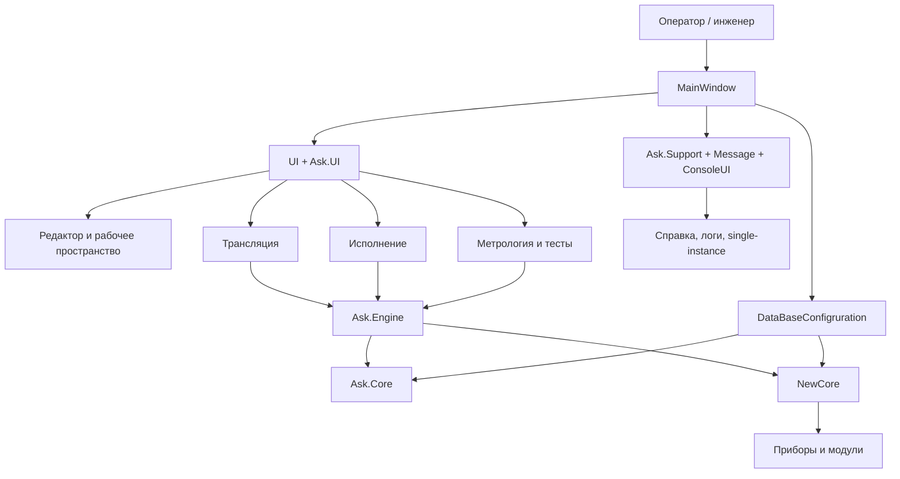

# Wiki AskMkiM

Это рабочая техническая Wiki по проекту `AskMkiM`.

Здесь мы собрали не рекламное описание, а карту системы:

- из каких проектов она состоит;
- как проходит запуск;
- как устроены редактор, трансляция и выполнение;
- где находятся режимы метрологии и проверки оборудования;
- как устроена работа с приборами;
- где живут база данных, настройки, справка и служебные подсистемы;
- как расширять проект без поиска по всему репозиторию вслепую.

## Как это попадает в GitHub Wiki

Папка `docs/wiki` — это исходник документации внутри основного репозитория.

Если мы хотим, чтобы страницы появились именно во вкладке `Wiki` на GitHub, мы выгружаем их в отдельный wiki-репозиторий `AskMkiM.wiki.git`.

Для этого в проекте есть скрипт `scripts/sync-github-wiki.sh`:

- он берет страницы из `docs/wiki`;
- собирает `Home.md` и `_Sidebar.md`;
- копирует остальные страницы в формат, удобный для GitHub Wiki;
- при необходимости может сразу выполнить `push`.

## Как читать Wiki

Если нужно быстро понять проект целиком, удобнее идти в таком порядке:

1. [Обзор решения](./01-solution-overview.md)
2. [Зависимости проектов](./02-project-dependencies.md)
3. [Запуск и жизненный цикл](./03-startup-lifecycle.md)
4. [UI и рабочее пространство](./04-ui-workspace.md)
5. [Язык команд и трансляция](./05-command-language-and-translation.md)
6. [Исполнение программ контроля](./06-execution-engine.md)
7. [Метрология и проверки оборудования](./07-metrology-and-hardware-tests.md)
8. [Устройства и коммуникация](./08-devices-and-communication.md)
9. [База данных и настройки](./09-database-and-settings.md)
10. [Служебные подсистемы](./10-support-systems.md)
11. [Точки расширения](./11-extension-points.md)

## Карта системы

## Быстрые ответы

### Где точка входа?

- `MainWindow/App.xaml.cs`

### Где главное окно?

- `MainWindow/MainWindow.xaml`
- `MainWindow/MainWindow.xaml.cs`
- `MainWindow/ViewModels/MainWindowViewModel.cs`

### Где трансляция?

- `MainWindow/Services/TranslationServices.cs`
- `Ask.Engine/ControlCommandAnalyser/CommandTranslationManager.cs`

### Где исполнение?

- `UI/Controls/Runner/RunControl.xaml.cs`
- `Ask.Engine/ControlCommandExecutor/Execution/CommandExecutionManager.cs`

### Где метрология и проверки оборудования?

- `MainWindow/Services/MetrologyService.cs`
- `MainWindow/Services/TestService.cs`
- `MainWindow/Services/SelfTestServices.cs`
- `Ask.Engine/Tests`

### Где устройства?

- `NewCore/Device`
- `NewCore/Communication`
- `NewCore/Function`
- `DataBaseConfigruration/Services/Device`

### Где база и настройки?

- `DataBaseConfigruration`
- `Ask.Core/Services/Config`

## Что особенно важно помнить

- В проекте есть два UI-слоя: `UI` и `Ask.UI`.
- Много регистраций делается автоматически через рефлексию, а не через один центральный switch.
- Проект нужен не только для выполнения программ контроля, но и для метрологии, самоконтроля и прикладных проверок оборудования.
- Значимая часть состояния хранится в статических конфигурационных менеджерах и в локальной SQLite-базе.
